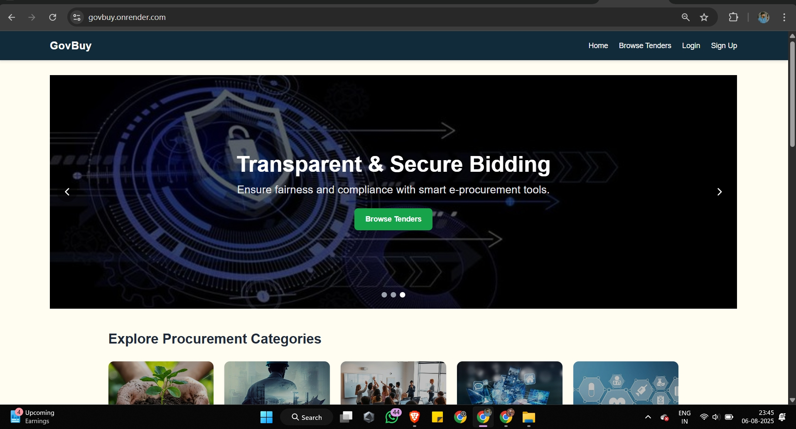
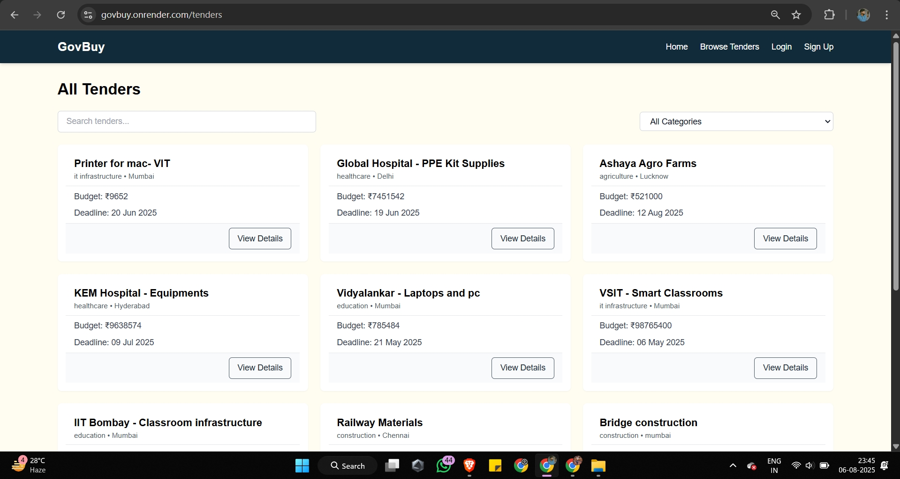
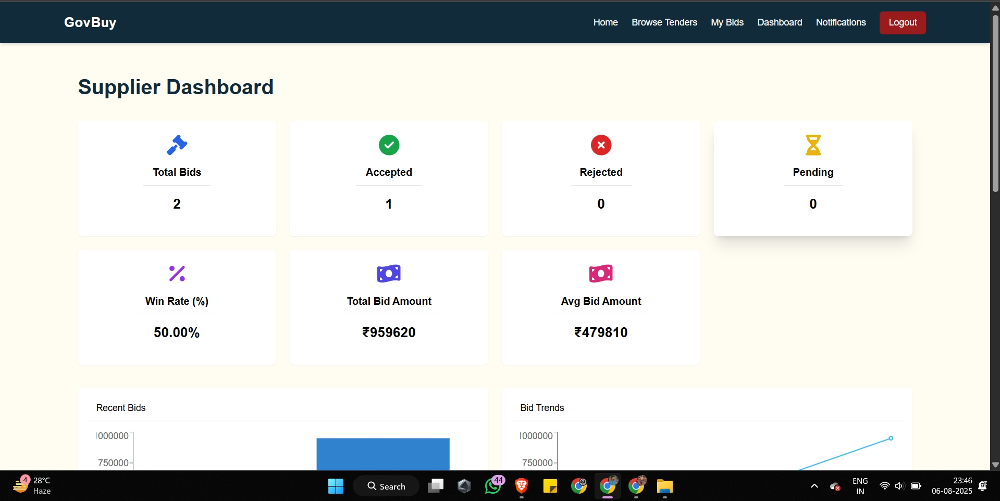
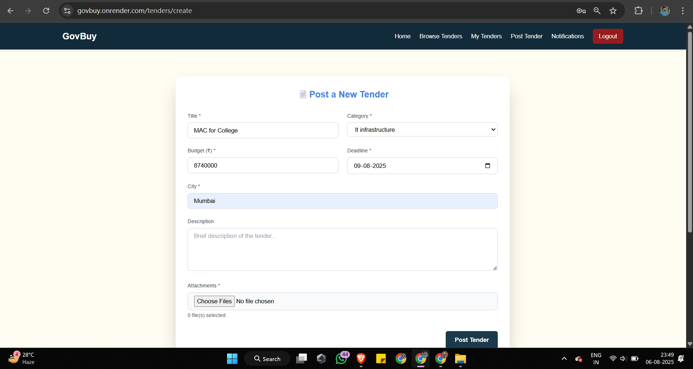
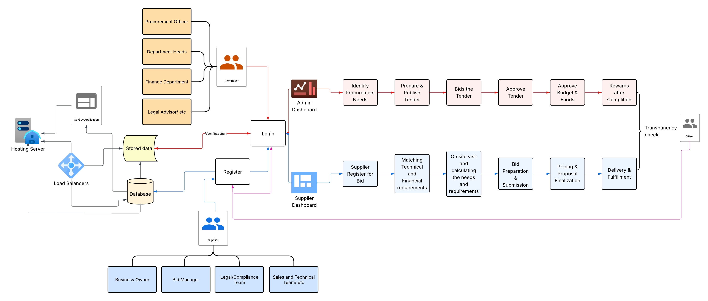

# 🌐 GovBuy - Government E-Procurement Platform

 <!-- Replace with your project banner -->

<p align="center">
  <a href="https://github.com/FarhanSayed16/GovBuy---Government-Procurement-Platform/stargazers"></a>
  <a href="https://github.com/FarhanSayed16/GovBuy---Government-Procurement-Platform/network/members"></a>
  
  
</p>

---

## 📌 Overview
**GovBuy** is a **full-fledged MERN-based e-procurement system** designed to ensure transparency, efficiency, and security in government procurement.  
The platform allows **vendor registration, tender creation, bidding, contract management, and analytics** all in one place.

---

## 🚀 Features
- 🔐 Secure **Vendor Registration & Authentication**
- 📝 **Tender Creation & Publishing** by government departments
- 💰 Transparent **Bidding & Evaluation System**
- 📊 **Admin & Vendor Dashboards**
- 📑 **Contract Management**
- 🔍 Search & filter tenders
- 📈 Reports & Analytics
- 🌍 Scalable and role-based access

---

## 🏗 Tech Stack
- **Frontend:** React.js, TailwindCSS  
- **Backend:** Node.js, Express.js  
- **Database:** MongoDB (Mongoose ODM)  
- **Authentication:** JWT / OAuth2  
- **Deployment:** Vercel (frontend), Render/Heroku (backend)

---

## 📂 Project Structure
```

GovBuy/
│── client/        # React frontend
│── server/        # Node.js & Express backend
│── models/        # MongoDB models
│── routes/        # API routes
│── controllers/   # Business logic
│── config/        # Database & env configs
│── assets/        # Images/screenshots for README
│── README.md

````

---

## ⚙️ Installation & Setup
```bash
# Clone the repository
git clone https://github.com/FarhanSayed16/GovBuy---Government-Procurement-Platform.git
cd GovBuy

# Setup backend
cd backed
npm install
npm run dev

# Setup frontend
cd frontend
npm install
npm start
````

---

## 📸 Screenshots

### 🔹 Landing Page



### 🔹 Dashboard



### 🔹 Vendor Portal



---

## 📊 System Architecture

 <!-- draw or export a diagram -->

---

## 🚀 Future Enhancements

* 🔗 Payment Gateway Integration
* 🤖 AI-powered tender analysis
* ⛓ Blockchain for transparency
* 📱 Mobile App (React Native/Flutter)
* 🌐 Multi-language support

---

## 🤝 Contributing

Pull requests are welcome. For major changes, please open an issue first to discuss.

---

## 👨‍💻 Authors

* **Farhan Sayed**

---

## 📜 License

This project is licensed under the **MIT License**.

```
